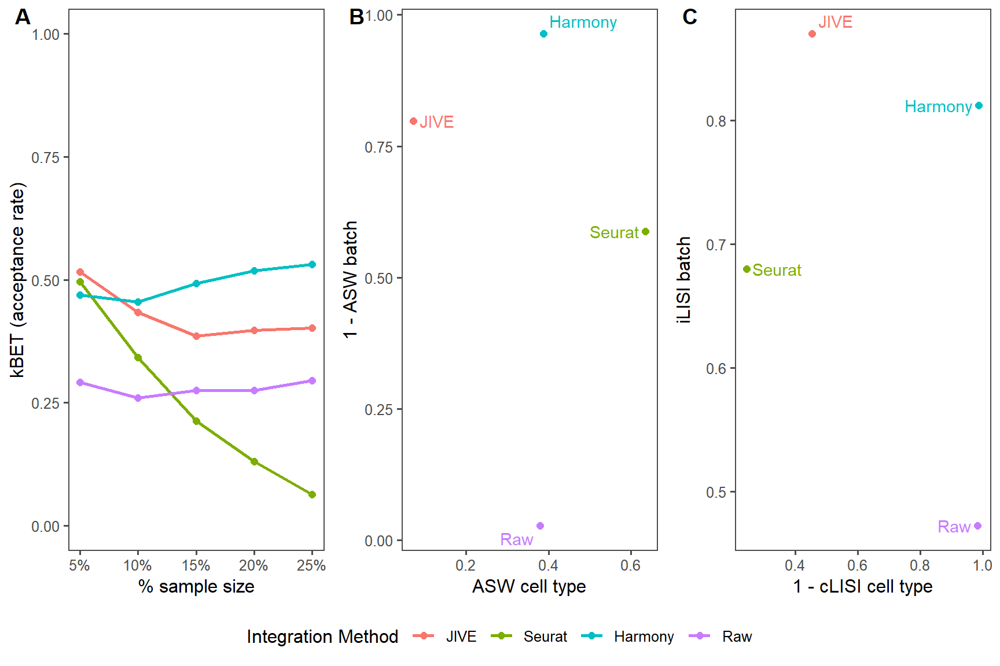

# Master's Project Paper (Joey Hastings)

**Title**: Batch-effect correction in single-cell RNA sequencing data using the JIVE decomposition

**Abstract**: We assessed a novel application of the JIVE decomposition to remove technical artifacts from single-cell RNA sequencing data and compare its performance to existing tools. We improved the runtime of the `r.jive` R package 

---

# **Introduction**

Correcting for batch effects is an important step in preprocessing scRNA-seq data prior to analysis. Batch effects are technical artifacts in the data that arise from a multitude of factors: different sequencing technologies, equipment used, or even capture times. These effects are not of interest and obfuscate the true underyling biological signal. In this paper we introduce a novel application of the JIVE method which we use to perform batch-effect correction on multiple scRNA-seq datasets. We employ three evaluations metrics and compare the results against two other tools, Seurat 3 and Harmony, which were developed for this purpose.

# **Batch-Effect Correction Methods**

We selected three batch correction methods and compared their performance against three scRNA-seq datasets. A description of each method is listed below.

## **JIVE**

> Lock, Eric F., et al. "Joint and individual variation explained (JIVE) for integrated analysis of multiple data types." The annals of applied statistics 7.1 (2013): 523.
> 
> [Joint and individual variation explained (JIVE) for integrated analysis of multiple data types][paper_JIVE]

The joint and individual variation explained (JIVE) method seeks to decompose two or more biological datasets into three low-rank approximation components: a joint structure among the datasets, individual structures unique to each distinct dataset, and residual noise. If we let $X_1$, $X_2$, ..., $X_k$ be matrices of dimension $p_i \times n$ containing the original datasets, then we have

$$
\begin{align*}
    X_1 &= J_1 + A_1 + \epsilon_1 \\
    X_2 &= J_2 + A_2 + \epsilon_2 \\
    \vdots \\
    X_k &= J_k + A_k + \epsilon_k 
\end{align*}
$$

where $J_i$ denotes the $i^{th}$ joint structure submatrix, $A_i$ denotes the $i^{th}$ individual structure matrix, and $\epsilon_i$ are error matrices with independent entries.

JIVE was originally created to decompose any set of related biological data: an example from the paper uses gene expression and miRNA data from a set of 234 Glioblastoma Multiforme tumor cells. Our main interest is how well the method performs when we apply it in the context of scRNA-seq data batch-effect correction. We expect the joint structure to serve as the corrected dataset which can then be used in further downstream analyses.

The JIVE decomposition estimates the joint and individual structures by minimizing the sum of squared error. Given an initial estimate for the joint structure, it finds the individual structures to minimize the sum of squared error. Then, given the new individual structures, it finds a new estimate for the joint structure which minimizes the sum of squared error. This process is repeated until a given threshold for convergence is reached. The ranks are estimated by one of two different methods: a permutation test rank selection and a BIC rank selection. 

### **Algorithm Improvements**

> O’Connell, Michael J., and Eric F. Lock. "R. JIVE for exploration of multi-source molecular data." Bioinformatics 32.18 (2016): 2877-2879.
>
> [R.JIVE for exploration of multi-source molecular data][paper_R.JIVE]

The JIVE algorithm was implemented into the `r.jive` R package from the original MATLAB code. The base functions provided in this package can take a substantial amount of runtime to get results (taking upwards of 12+ hours depending on data). We improved the speed of these functions in two main ways: utilizing partial singular value decomposition in the `RSpectra` package and converting frequently used matrix operations into precompiled C++ code using the `Rcpp` package and the Eigen library.

#### **Partial SVD Benchmarks**

The original `r.jive` code utilizes an SVD in many different areas, however only the largest singular values/vectors are used. A full decomposition is takes a lot of time and resources to compute and the majority are not used. We switched to a truncated SVD provided by the `svds()` function in the `RSpetra` package which returns the $k$ largest singular values/vectors of a given matrix.

We compared the `svds()` function to the `svd()` function that is used in the `r.jive` package. A benchmark was performed on a $1000 \times 1000$ dataset generated from a standard normal distribution in which each function call was performed 100 times. The performance of each function can be seen in the following plot:

We can see that the runtime for the partial SVD vastly outperforms the full SVD. We replaced all instances in the original `r.jive` code that use the top singular values/vectors from `svd()` and with an `svds()` call.

#### **Matrix Multiplication Benchmarks**

The other area in which we made signficant improvements was in basic matrix operations. We tested three different functions which implemented C++ code to perform matrix multiplication and compared their performance to the default `%*%` operator in R. One function uses the Armadillo C++ library and the other two use the Eigen C++ library. A benchmark was performed by multiplying two $1000 \times 1000$ matrices generated from a standard normal distribution in which each function call was performed 100 times. The performance for each function can be seen in the following plot:

The first column is the base `%*%` operator provided in R. The second column uses the `armaMatMult()` function which utilizes the Armadillio library. The next four columns use the `eigenMapMatMult2()` function that are utilizing one, two, four, and eight CPU cores, respectively. The last four columns use the `eigenMatMult()` function that are also utilizing the specified CPU cores.

We see drastic improvements in runtime with the two functions that use the Eigen C++ library. These two functions gave similar performance, so we chose to use `eigenMapMatMult2()`. We replaced all instances in the original `r.jive` code that use regular matrix multiplication `%*%` with an `eigenMapMatMult2()` call. The number of cores used to perform the multiplication can be specified as a parameter.

## **Seurat 3**

> Stuart, Tim, et al. "Comprehensive integration of single-cell data." Cell 177.7 (2019): 1888-1902.
>
> [Comprehensive Integration of Single-Cell Data][paper_Seurat]

The Seurat 3 integration method employs a sophisticated strategy which "anchors" diverse datasets together. First, log-normalization is performed on all datasets and expression values are standardized for each gene. A subset of features are selected which exhibit high variance across all datasets. Then an initial dimension reduction method utilizing canonical correlation analysis (CCA) is performed to ensure similarities across datasets are preserved. Canonical correlation vectors (CCV) are then approximated and used to identify K-nearest neighbors (KNN) for each cell within their paired dataset. Mutual nearest neighbors (MNN) are then identified to act as anchors between datasets. These anchors are then filtered, scores, weighted, and used to perform the batch correction. Functions to perform these tasks are available in the `Seurat` R package.

## **Harmony**

> Korsunsky, Ilya, et al. "Fast, sensitive and accurate integration of single-cell data with Harmony." Nature methods 16.12 (2019): 1289-1296.
>
> [Fast, sensitive, and accurate integration of single cell data with Harmony][paper_Harmony]

The Harmony integration method utilizes PCA for dimensionality reduction and then iterates between two algorithms until convergence is reached. The first algorithm clusters cells from multiple batches but ensures that the diversity of batches within each cluster are maximized (i.e., maximum diversity clustering). The second algorithm then uses a mixture model based approach to perform linear batch correction from a given vector of the known batches. The clustering step assigns soft clusters to cells and the correction step uses these clusters to compute new cell embeddings from the previous iteration. Functions to perform these tasks are available in the `Harmony` R package.

# **Batch Correction Evaluation**

We employed four tools/metrics to evaluate the performance of each of the batch correction methods: visual inspection of t-distributed stochastic neighbor embedding (t-SNE) and uniform manifold approximation and projection (UMAP) dimension reduction plots, k-nearest neighbor batch effect tests (kBET), average silhouette width (ASW), and local inverse Simpson's index (LISI).

For the visual inspections, we expect to see cells from different batches overlapping each other in the plots with distinct cell type clusters. This is indicative of well-mixed (i.e., integrated) batches that preserve cell type heterogeneity.

## **t-Distributed Stochastic Neighbor Embedding**

> Van der Maaten, Laurens, and Geoffrey Hinton. "Visualizing data using t-SNE." Journal of machine learning research 9.11 (2008).
>
> [Visualizing Data using t-SNE ][paper_t-SNE]

t-SNE is a non-linear dimension reduction technique that aids in visualizing high-dimensional data by assigning each data point a location in a two or three-dimensional map. It aims to preserve as much of the local structure of the original data as possible while also revealing global structure such as clusters. High dimensional Euclidean distances between points are used to create conditional probabilities of one point picking the other as its neighbor. A similar conditional probability is calculated for a low dimensional representation of the data. The goal of t-SNE is to find a low dimensional (i.e., two or three dimension) representation that matches the two probabilities as best as possible by minimizing a certain objective function. 

## **Uniform Manifold Approximation and Projection**

> McInnes, Leland, John Healy, and James Melville. "Umap: Uniform manifold approximation and projection for dimension reduction." arXiv preprint arXiv:1802.03426 (2018).
>
> [UMAP: Uniform Manifold Approximation and Projection for Dimension Reduction][paper_UMAP]

UMAP is a non-linear dimension reduction technique that is based in manifold theory and topological data analysis. It can be separated into two main phases: graph construction and graph layout. In the graph construction phase, a weighted k-nearest neighbor graph is created, transformations are applied to the graph's edges, and asymmetry is dealt with. In short, it ensures that the underlying geometric structure of the data is captured. In the graph layout phase, an objective function is defined that preserves important characteristics present in the k-nearest neighbor graph, and the final UMAP representation is the one which minimizes this function.

## **k-Nearest Neighbor Batch Effect Test**

> Büttner, Maren, et al. "A test metric for assessing single-cell RNA-seq batch correction." Nature methods 16.1 (2019): 43-49.
>
> [A test metric for assessing single-cell RNA-seq batch correction][paper_kBET]
> 
> [Github][github_kBET]

The kBET metric was constructed with the following premise in mind: a subset of a well-mixed dataset with batch-effects removed should have the same distribution of batch labels as the full dataset. A $\chi^2$-based test is performed for random subsets of a fixed size neighborhood and results from each test (i.e., reject or fail to reject) is averaged over to provide an overall rejection rate. If the rejection rates are low, then we failed to reject most of the $\chi^2$ tests, and thus the distribution of batch labels in the small neighborhoods were not significantly different from the entire data's distribution of batch labels.

We calculate the rejection rates with neighborhood sizes equal to 5%, 10%, 15%, 20%, and 25% of the number of cells in each dataset. We then use the first 30 principal components from the batch-effect corrected datasets to perform the kBET at each neighborhood size. We then calculate the "acceptance rate" (1 - rejection rate) so that larger values are more desirable.

## **Average Silhouette Width**

> Rousseeuw, Peter J. "Silhouettes: a graphical aid to the interpretation and validation of cluster analysis." Journal of computational and applied mathematics 20 (1987): 53-65.
>
> [Silhouettes: A graphical aid to the interpretation and validation of cluster analysis][paper_silhouette]

A silhouette is a measure of consistency within clusters of a given dataset. For each data point in a given cluster, we calculate the mean distance between itself and all other points within the same cluster. We also calculate the smallest mean distance between itself and any other data point not in the same cluster. Then a silhouette is the difference of these two values scaled by the largest of the two. A silhouette takes on values between -1 and 1, with values close to 1 indicating that a particular point is appropriately clustered and values close to -1 indicating the opposite. The ASW is the average of all silhouette values which gives an measure of how well-clustered the data are as a whole.

For our purposes, we use the Euclidean distance metric for all calculations. We then subsample our data down to 80% of the original and use the first 30 principal components from the subsampled batch-effect corrected datasets. We calculate two ASW metrics: ASW batch (the batch labels are the clusters) and ASW cell type (cell type labels are the clusters), and this process is repeated 20 times for each method. ASW batch and ASW cell type results from all methods are separately scaled to be between 0 and 1. We report 1 - ASW batch values so that large values are more desirable. The median values of each of these scores are then used for comparison across all methods.

## **Local Inverse Simpson's Index**

> Korsunsky, Ilya, et al. "Fast, sensitive and accurate integration of single-cell data with Harmony." Nature methods 16.12 (2019): 1289-1296.
>
> [Fast, sensitive, and accurate integration of single cell data with Harmony][paper_Harmony]

The local inverse Simpon's index first builds local Gaussian kernel-based distributions of neighborhoods. These neighborhoods are then used in conjuction with the inverse Simpon's index to calculate a diversity score which corresponds to the effective number of clusters in a particular cell's neighborhood.

We calculate two LISI metrics: LISI for batch label clusters (iLISI batch) and LISI for cell type clusters (cLISI cell type). Both LISI scores are calculated for each cell in the batch-effect corrected datasets for each method. iLISI and cLISI results from all methods are separately scaled to be between 0 and 1. We report 1 - cLISI cell type so that large values are more desirable. The median values of each of these scores are then used for comparison across all methods.

---

# **Datasets**

> Li, Jianying, et al. "Principal variance components analysis: estimating batch effects in microarray gene expression data." Batch Effects and Noise in Microarray Experiments: Sources and Solutions (2009): 141-154.
>
> [Principal Variance Components Analysis: Estimating Batch Effects in Microarray Gene Expression Data][paper_PVCA]

One simulated dataset and two real scRNA-seq datasets were used to evaluate the performance of the batch correction methods. Principal variance component analysis (PVCA) was performed for each raw dataset to get an idea of how much variability is attributed to batch labels, cell cluster labels, and random error. PVCA uses principal components from PCA and variance components analysis (VCA) to fit a mixed linear model using factors of interest as random effects to partition estimate and partition total variability in the data.

## **Simulated Data**

> Zappia, Luke, Belinda Phipson, and Alicia Oshlack. "Splatter: simulation of single-cell RNA sequencing data." Genome biology 18.1 (2017): 174.
>
> [Splatter: simulation of single-cell RNA sequencing data][paper_splatter]

The simulated data was created using the `splatter` R package. The core of the Splat model is a gamma-Poisson distribution which is used to generate a matrix of cell counts for a given number of genes. More than 20 different parameters are available for modifying, including parmaters that affect library size, the size of batch effects, gene means, expression outliers, and more. In our dataset, we chose to simulate a data for 5000 genes with two batches containing 500 cells each consisting of three different cell clusters in similar proportions between batches. No data preprocessing was performed and all data generated was used as input for each method.

We observe that almost 95% of the variability within the data is not due to the batch or cell clusters which is consistent with most scRNA-seq data. 

We can see from the t-SNE and UMAP plots that each method has the batches overlapping while the cell clusters are still preserved and distinct from one another. In contrast, the raw plots show some clear seperation between batches.

The best performing method for the kBET metric is Harmony followed by JIVE. Seurat surprisingly performed worse than the raw data.

JIVE and Harmony performed well for the ASW batch metric, closely followed by Seurat. However, Seurat outperformed all methods with regards to the ASW cell type metric. This indicates that Seurat was much better at preserving the different cell types within its cell embeddings than JIVE and Harmony, but not able to distinguish between batches.

Harmony and JIVE performed very well on both the iLISI batch and cLISI cell type metrics. Seurat did not do well with regards to iLISI batch, but was serviceable for the cLISI cell type metric.

Overall, JIVE and Harmony were the best performing batch-effect correction methods for the simulated data.

## **Bacher T-Cell Data**

> Bacher, Petra, et al. "Low-avidity CD4+ T cell responses to SARS-CoV-2 in unexposed individuals and humans with severe COVID-19." Immunity 53.6 (2020): 1258-1271.
>
> [Low-Avidity CD4+ T Cell Responses to SARS-CoV-2 in Unexposed Individuals and Humans with Severe COVID-19][paper_bacher]

The Bacher CD4+ T-cell RNA sequencing data was obtained from six unexposed and fourteen COVID-19 patients. There are a total of fifteen different batches and six different cell clusters provided. This data was chosen as there are not very large distinctions between batches, so we wished to see how the methods would perform. We utilized the standard preprocessing steps from Seurat to identify the top 2000 genes with highest variability across all batches. We also only considered the two batches labeled "14" and "15". This reduces the data from $33538 \times 104417$ to $2000 \times 1867$ genes and cells.

We see more variability attributed to the batch and cell clusters than in our simulated data, with almost 5% and 10%, respectively.

We see that Seurat and Harmony both have well-mixed batches in the dimensionality reduction plots, while JIVE does not. The cell clusters look to be well preserved in all three methods.

Seurat performs the best with regars to kBET, while Harmony and JIVE are close behind. Interestingly, JIVE consistently performs worse as the neighborhood size increases.

Harmony and Seurat both perform best in the ASW metrics, while JIVE barely outperforms the raw data with regards to ASW batch and actually performs worse in ASW cell type.

Harmony is the clear winner in the LISI metrics followed closely by Seurat. Notably, JIVE performs worse than the raw data in both metrics. It is worth noting that the cLISI cell type is on a much tighter scale than the iLISI batch metric in the plot.

## **Zilionis Mouse Lung Data**

> Zilionis, Rapolas, et al. "Single-cell transcriptomics of human and mouse lung cancers reveals conserved myeloid populations across individuals and species." Immunity 50.5 (2019): 1317-1334.
>
> [Single-Cell Transcriptomics of Human and Mouse Lung Cancers Reveals Conserved Myeloid Populations across Individuals and Species][paper_zilionis]
>

The Zilionis mouse lung data analyzed tumor-infiltrating myeloid cells in mouse lung cancers. There are a total of three different batches and seven different cell clusters provided. This data was chosen as there we can see some distinct separation due to a batch effect and the cell clusters are well seperated. We perform the same preprocessing as described for the Bacher T-cell data, select only two batches, and only two cell clusters (B-cells and T-cells). This helps to reduce the data from $28205 \times 17549$ to $2000 \times 2533$ genes and cells.

We see a similar breakdown of total variability as the Bacher T-cell data except a bit more is attributed to the cell clusters.

We see that each method has well-mixed batches and cell clusters are preserved. It is interesting to note that both JIVE and Seurat produced two distinct clusters that consist of a mix of both cell clusters, while Harmony was able to keep the cell clusters away from each other.

We see that all three methods perform similarly at low neighorhood levels. However as the size increases, Seurat drops off dramatically. Harmony seems to perform best at kBET with JIVE close behind.

The ASW metric performances are a bit of a mixed bag: each method is better than another at either ASW batch or ASW cell type. Harmony performs best at ASW batch, followed by JIVE and then Seurat. Seurat performs best at ASW cell type, followed by Harmony and then JIVE.

JIVE and Harmony are the best performers in the LISI metrics, with JIVE being the best with regards to iLISI batch and Harmony winning out in cLISI cell type. Seurat performs worse than both JIVE and Harmony, and only beats the raw data with regards to iLISI batch.

# **Discussion and Conclusion**

---

[paper_JIVE]: https://doi.org/10.1214/12-aoas597
[paper_R.JIVE]: https://academic.oup.com/bioinformatics/article/32/18/2877/1744043
[paper_Seurat]: https://doi.org/10.1016/j.cell.2019.05.031
[paper_Harmony]: https://www.nature.com/articles/s41592-019-0619-0

[paper_t-SNE]: https://www.jmlr.org/papers/v9/vandermaaten08a.html
[paper_UMAP]: https://doi.org/10.48550/arXiv.1802.03426
[paper_kBET]: https://www.nature.com/articles/s41592-018-0254-1
[github_kBET]: https://github.com/theislab/kBET
[paper_silhouette]: https://www.sciencedirect.com/science/article/pii/0377042787901257

[paper_PVCA]: https://doi.org/10.1002/9780470685983.ch12

[paper_splatter]: https://genomebiology.biomedcentral.com/articles/10.1186/s13059-017-1305-0
[paper_bacher]: https://www.sciencedirect.com/science/article/pii/S1074761320305033
[paper_zilionis]: https://www.sciencedirect.com/science/article/pii/S1074761319301268
