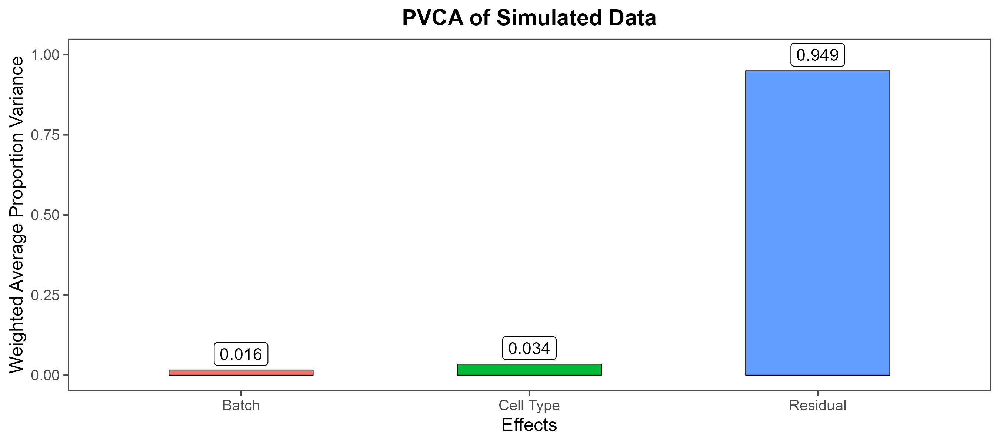
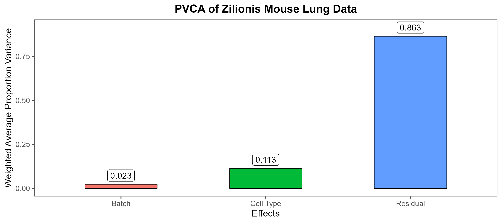
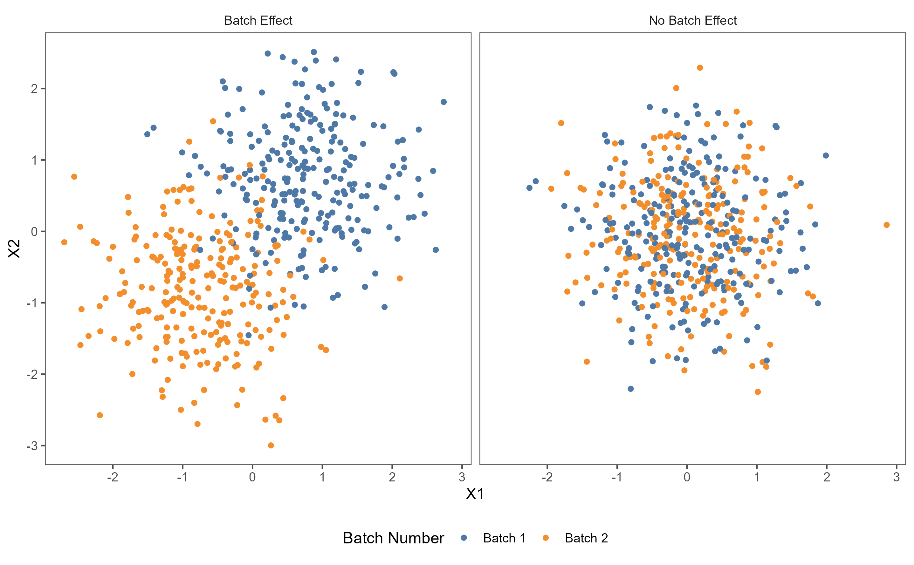
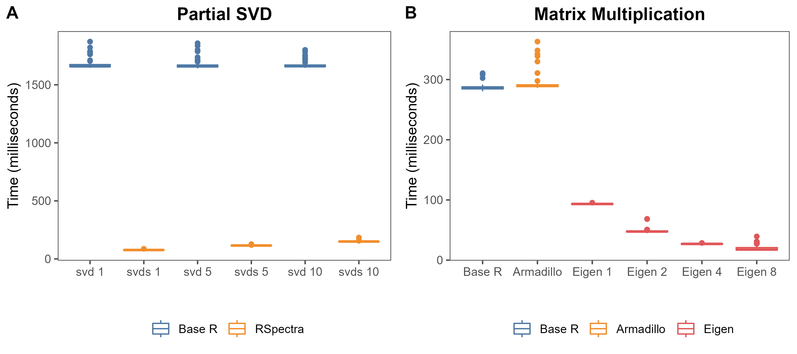
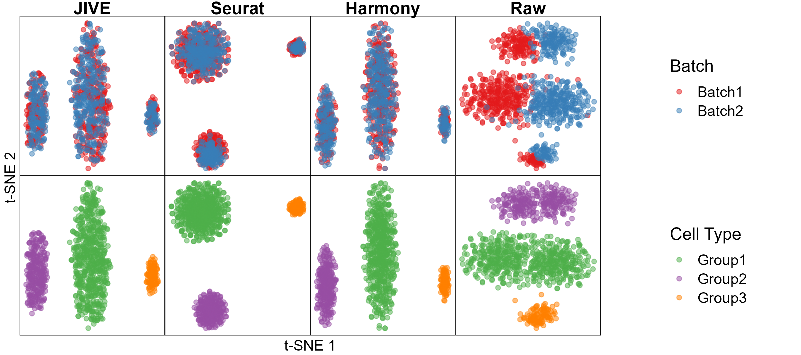
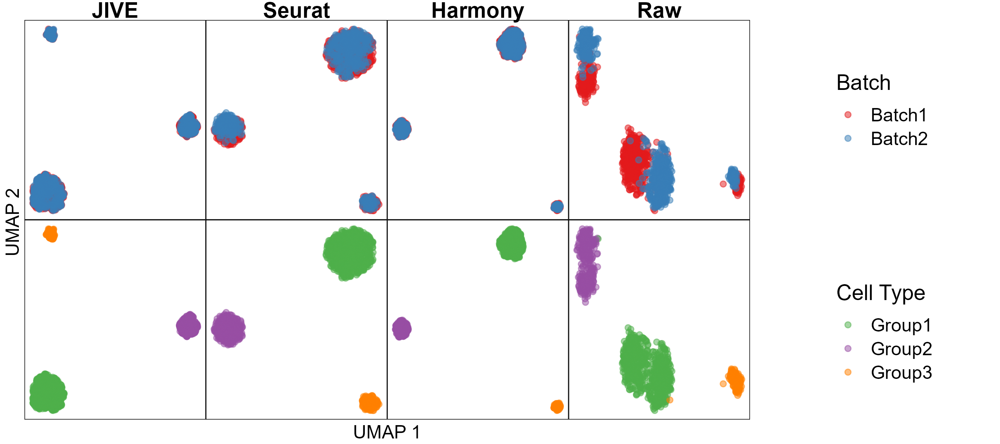
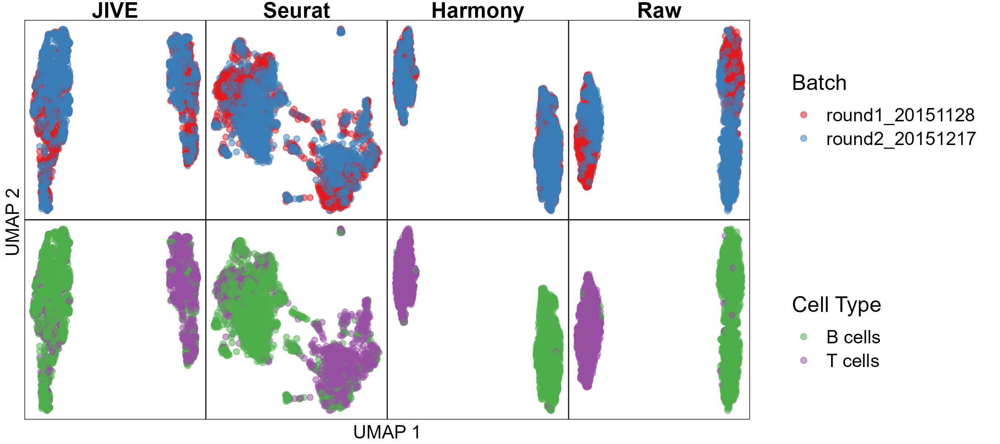

```{r setup, include=FALSE}
knitr::opts_chunk$set(echo = FALSE)
```

## Overview

* Introduction
  * Single-cell RNA Sequencing
  * Batch-Effect Correction Methods
  * JIVE
* Methods
  * scRNA-seq Datasets
  * JIVE Algorithm Improvements
  * Batch Correction Evaluation Metrics
* Results
  * JIVE Runtime Improvements
  * Simulated Data
  * Assessments Using Real Data
* Discussion

# Introduction

## Single-cell RNA Sequencing

### RNA Sequencing Background

* Technique used to study the expression and regulation of genes
* Isolates and sequences RNA molecules

<!-- Sequencing refers to the process of determining the precise order of nucleotides (A, C, G, and T) in a DNA or RNA molecule. The sequence of nucleotides provides important information about the genetic code of an organism, including the genes it contains, the functions of those genes, and potential variations that may influence disease susceptibility or drug response. -->

* Comprehensive view of the transcriptome
<!-- RNA-seq can provide a comprehensive view of the transcriptome, including the identification of known and novel genes. The transcriptome is the full range of messenger RNA, or mRNA, molecules expressed by an organism
It can also be used to study gene regulation, including the identification of transcription factor binding sites and regulatory elements. -->

* Many applications:
  * Gene expression analysis
  <!-- RNA-seq can quantify the expression levels of all genes in a cell or tissue, providing insights into gene regulation and function. -->
  
  * Differential gene expression analysis
  <!-- RNA-seq can identify genes that are differentially expressed between two or more conditions, such as diseased versus healthy tissue, or treated versus untreated cells. -->
  
  * Functional annotation
  <!-- RNA-seq can be used to annotate novel transcripts and identify their potential functions -->
  
  * Biomarker discovery
  <!-- RNA-seq can be used to identify potential biomarkers for disease diagnosis, prognosis, and treatment -->

---
  
## Single-cell RNA Sequencing

### Bulk RNA Sequencing versus Single-cell RNA Sequencing

* Resolution
  * Entire population of cells vs. individual cells
<!-- Bulk RNA-seq measures gene expression across an entire population of cells, whereas scRNA-seq measures gene expression in individual cells. This allows scRNA-seq to capture cell-to-cell variability, identify rare cell types, and study cell-state transitions. -->

* Cell number
  * Large number of cells (tens of thousands to millions) vs. fewer number of cells required (hundreds to thousands)
<!-- Bulk RNA-seq requires a large number of cells, typically in the range of tens of thousands to millions, while scRNA-seq requires only a few hundred to a few thousand cells. -->

* Coverage
  * Measures average gene expression across all cells in a sample vs. measures expression of genes in each individual cell
<!-- Bulk RNA-seq measures the average expression of genes across all cells in a sample, whereas scRNA-seq measures the expression of genes in each individual cell. This can result in lower coverage for individual genes in scRNA-seq, particularly in rare cell types. -->

* Cost
  * Bulk RNA-seq less expensive per cell, cost per sample higher compared to scRNA-seq
<!-- Bulk RNA-seq is typically less expensive per cell than scRNA-seq, but the cost per sample is often higher due to the larger number of cells required. -->

* Data analysis
  * scRNA-seq data requires more specialized tools
<!-- Data analysis for bulk RNA-seq is relatively straightforward, whereas scRNA-seq analysis requires specialized tools and methods to account for cell-to-cell variability, batch effects, and other sources of noise. -->

## Single-cell RNA Sequencing


<!-- https://cdn.technologynetworks.com/tn/images/body/11570107721805.jpg -->

## Single-cell RNA Sequencing

### Data

* scRNA-seq data consists of a count matrix
<!-- Sequencing data consists of a count matrix for a given set of genes obtained from a sample of cells. These counts represent the number of times that a specific gene is detected in a single cell  -->

* Rows represent genes, columns represent cells

* Library size
<!-- The library size for a cell is the sum of all counts across all genes -->

### Preprocessing

* Normalization
  * Counts per million (CPM)
  <!-- In CPM normalization, each count is divided by its cell's library size and multiplied by a million -->
  
  * Upper quartile (UQ)
  <!-- UQ normalization uses a scaling factor proportional to the 75th percentile of the counts for a given cell -->
  
  * Trimmed mean of M values (TMM)
  <!-- TMM normalization seeks to trim away cell counts that exhibit large log fold differences within a cell -->
  
## Single-cell RNA Sequencing

### Dataset Integration

* Cell counts can be obtained from different batches
  * Batch effects
  <!-- Unwanted technical variation and differences between count data are known as batch effects. These effects can arise due to different sequencing technologies being used or cells being sequenced at different times. -->
* Many methods developed to remove these batch effects

## Batch-Effect Correction Methods
### Seurat v3

* Software package developed by the Satija lab
* Graph based approach to dataset integration
* Maps cells in each dataset to their closest anchors
* Aligned datasets are combined into a single integrated dataset

## Batch-Effect Correction Methods
### Seurat v3


<!-- (A) Representation of two datasets, reference and query, each of which originates from a separate single-cell experiment. The two datasets share cells from similar biological states, but the query dataset contains a unique population (in black). -->

<!-- (B) We perform canonical correlation analysis, followed by L2 normalization of the canonical correlation vectors, to project the datasets into a subspace defined by shared correlation structure across datasets. -->

<!-- (C) In the shared space, we identify pairs of MNNs across reference and query cells. These should represent cells in a shared biological state across datasets (gray lines) and serve as anchors to guide dataset integration. In principle, cells in unique populations should not participate in anchors, but in practice, we observe “incorrect” anchors at low frequency (red lines). -->

<!-- (D) For each anchor pair, we assign a score based on the consistency of anchors across the neighborhood structure of each dataset. -->

<!-- (E) We utilize anchors and their scores to compute “correction” vectors for each query cell, transforming its expression so it can be jointly analyzed as part of an integrated reference. -->

## Batch-Effect Correction Methods
### Harmony

* Utilizes low-dimensional representation of datasets
* Iterates between two algorithms until convergence:
  * Clustering which preserves diversity
  * Batch correction

## Batch-Effect Correction Methods
### Harmony


<!-- (a) Harmony uses fuzzy clustering to assign each cell to multiple clusters, while a penalty term ensures that the diversity of datasets within each cluster is maximized. -->

<!-- (b) Harmony calculates a global centroid for each cluster, as well as dataset-specific centroids for each cluster. -->

<!-- (c) Within each cluster, Harmony calculates a correction factor for each dataset based on the centroids. -->

<!-- (d) Finally, Harmony corrects each cell with a cell-specific factor: a linear combination of dataset correction factors weighted by the cell’s soft cluster assignments made in step a. Harmony repeats steps a to d until convergence. -->

## JIVE

### Joint and individual variance explained (JIVE)
* Integrates multi-omics data by a decomposition method
  * Low-rank approximation for joint data variation
  * Low-rank approximations for individual dataset variations
  * Residual noise
* Simultaneous integration and dimension reduction
* Can enforce orthogonality between joint and individual structures
* Originally developed for bulk sequencing data

## JIVE

### Model

* Let $X_1$, $X_2$, $\ldots$, $X_k$ with $k \ge 2$ be matrices
* $X_i$ has dimension $p_i \times n$
  * $n$ columns corresponding to a common set of $n$ objects
  * $p_i$ rows corresponding to variables in a given measurement technology
  * $\sum p_i = p$
* Unified JIVE model:

\begin{align}
    \begin{split}
    X_{1} &= J_{1} + A_{1} + \epsilon_{1} \\
    X_{2} &= J_{2} + A_{2} + \epsilon_{2} \\
    \vdots & \\
    X_{k} &= J_{k} + A_{k} + \epsilon_{k} \\
    \end{split}
\label{eq:jive_pca}
\end{align}

## JIVE

### Model

* Joint structure is represented by $J$, a single $p \times n$ matrix of rank $r < \text{rank}(X)$

\begin{align}
  J = \begin{bmatrix} J_1 \\ \vdots \\ J_k \end{bmatrix}_{p \times n}
\end{align}

* $J_i$ is the submatrix of $J$ associated with $X_i$
* Individual structures for each $X_i$ is represented by $A_i$, a $p_i \times n$ matrix of rank $r_i < \text{rank}(X_i)$
* $\epsilon_i$ are independent error matrices with $\mathbb{E}(\epsilon_i) = \mathbf{0}_{p_i \times n}$

## JIVE

### Relation to Principal Component Analysis

* Given a dataset $X_{p \times n}$ with variance-covariance matrix $\Sigma_{p \times p}$, perform an eigendecomposition on $\Sigma$:

\begin{align}
  \Sigma_{p \times p} = U_{p \times p} D_{p \times p} U_{p \times p}^T
\end{align}

* $U$ denotes the $p$ eigenvectors (known as loadings)
* $D$ is the diagonal matrix containing the $p$ eigenvalues of $\Sigma$

## JIVE

### Relation to Principal Component Analysis

* Can calculate a rank $r$ approximation to $X$ in the following way:

\begin{align}
  X_{p \times n} &\approx U_{p \times r} S_{r \times n}
\end{align}

* $U$ is the first $r$ columns from the loading matrix
* $S$ is the first $r$ rows from the scores matrix

## JIVE

### Relation to Principal Component Analysis

* JIVE model can be written in a similar manner:

\begin{align}
    \begin{split}
    X_{1} &\approx U_{1} S + W_{1} S_{1} + R_{1} \\
    X_{2} &\approx U_{2} S + W_{2} S_{2} + R_{2} \\
    \vdots & \\
    X_{k} &\approx U_{k} S + W_{k} S_{k} + R_{k}
    \end{split}
\end{align}

* $U_i$ are the loadings of the joint structure corresponding to rows of $X_i$
* $S$ is a common score matrix for the joint structure
* $W_i$ is a $p_i \times r_i$ loading matrix, $S_i$ is an $r_i \times n$ score matrix

## JIVE

### Estimation

* Estimates joint and individual structures by minimizing the sum of squared error:

\begin{align}
  R = \begin{bmatrix} R_1 \\ \vdots \\ R_k \end{bmatrix} = \begin{bmatrix} X_1 - J_1 - A_1 \\ \vdots \\ X_k - J_k - A_k \end{bmatrix}
\end{align}

* Given an estimate for $J$, find $A_1, \ldots, A_k$ to minimize $|| R ||$
* Given an estimate for $A_1, \ldots, A_k$, find $J$ to minimize $|| R ||$
* Repeat until convergence

## JIVE

### Viable Batch-Effect Correction Method?

* JIVE estimates the joint and individual structures and performs dimension reduction simultaneously
  * Expect the joint structure to capture true biological signal
  * Expect the individual structures to capture technical effects
* Possible superior performance as less information is lost
  * Other methods "regress out" technical effects
  * In JIVE, effects not captured by joint structure will be in an individual structure, and vice versa
* We consider the common set of $n$ objects to be genes measured in different batches
* We consider the $p_i$ variables to be the different cells in batch $i$

# Methods

## scRNA-seq Datasets

* One simulated dataset and two real scRNA-seq datasets considered
* Two batches generated or selected from each with at least two different cell types
* Principal variance component analysis (PVCA) performed on each dataset
  * Utilizes principal components and variance components analysis
  * Fits a mixed linear model to partition the total observed variability into variability attributed to batch effects, cell type effects, and random error

## scRNA-seq Datasets

### Simulated Data

* `Splatter` R package used to simulate a scRNA-seq dataset
* Core of the model is a gamma-Poisson distribution to generate cell counts for a set number of genes
* More than 20 different parameters to modify
  * Library size, gene expression means, outlier probability, batch effects, and more

## scRNA-seq Datasets

### Simulated Data

* Generated two batches with 500 cells each
* Each batch contained three cell types in similar proportion
* Simple dataset to test the ability of JIVE

\begin{table}[ht]
        \caption{Batch and Cell Type Frequency for Simulated Data}
        \centering
        \begin{tabular}{lrrrr}
        \hline
        Batch Name & Group 1 & Group 2 & Group 3 & Total \\
        \hline
        Batch1 & $312$ & $136$ & $52$ & $500$ \\
        Batch2 & $294$ & $148$ & $58$ & $500$ \\
        \hline
        \end{tabular}
\end{table}

## scRNA-seq Datasets

### Simulated Data



## scRNA-seq Datasets

### Bacher T-Cell Data

* CD4+ T-Cell scRNA sequencing data obtained from six unexposed and fourteen COVID-19 positive patients
* Fifteen total batches and six different cell types provided
* Not a lot of distinction between batches and cell types, difficult to integrate

\begin{table}[ht]
    \caption{Batch and Cell Type Frequency for Bacher T-Cell Data}
    \centering
    \begin{tabular}{lrrrr}
    \hline
    Batch & Central  & Cycling & Cytotoxic & Tfh-like \\
    Name  & Memory   &         &  / Th1    &          \\
    \hline
    14    & $230$    & $1$     &  $76$     & $250$    \\
    15    & $239$    & $4$     & $143$     & $425$    \\
    \hline
          &  Transitional & Type-1 IFN  & Total \\
          &  Memory       & signature   &       \\
    \hline
    14    &  $190$        &  $7$        &  $754$ \\
    15    &  $289$        & $13$        & $1113$ \\
    \hline
    \end{tabular}
    \label{tab:freq_bacher}
\end{table}

## scRNA-seq Datasets

### Bacher T-Cell Data


## scRNA-seq Datasets

### Zilionis Mouse Lung Data

* Analyzed tumor-infiltrating myeloid cells in mouse lung cancers
* Three total batches and seven cell types provided
* Distinct separation between batches and chosen cell types are not similar

\begin{table}[ht]
    \caption{Batch and Cell Type Frequency for Zilionis Mouse Lung Data}
    \centering
    \begin{tabular}{lrrr}
        \hline
        Batch Name & B cells & T cells & Total \\
        \hline
        round1\_20151128 & $641$ & $579$ & $1220$ \\
        round2\_20151217 & $879$ & $434$ & $1313$ \\
        \hline
        \end{tabular}
    \label{tab:freq_zilionis}
\end{table}

## scRNA-seq Datasets

### Zilionis Mouse Lung Data



## JIVE Algorithm Improvements

* Original MATLAB code was implemented into the `R.JIVE` R package
  * Joint and individual structure estimation can take a considerable amount of time (12+ hours) depending on the size of the datasets
* We improved the speed of these algorithms in two ways:
  * Utilizing partial singular value decomposition (SVD) via the `RSpectra` R package
  * Converting frequently used matrix operations into precompiled C++ code using the `Rcpp` and `RcppEigen` R packages

## JIVE Algorithm Improvements

### Partial SVD

* Original `R.JIVE` code utilizes the SVD in multiple areas
  * Only the largest singular values/vectors are used
* Performing a full SVD takes a considerable amount of time and resources to compute
  * Majority of it is not even used
  
## JIVE Algorithm Improvements

### Partial SVD

* We switched to a partial SVD function in the `RSpectra` R package which calculates and returns the $k$ largest singular values/vectors
* We performed a benchmark comparing this new function with the base R function
  * Generated a $1000 \times 1000$ matrix from a standard normal distribution
  * $k=1$, $5$, and $10$ singular values/vectors were calculated for each function
  * Repeated this process 100 times for each function call, runtime was recorded

## JIVE Algorithm Improvements

### Matrix Multiplication

* Matrix multiplication is utilized constantly throughout the algorithm
* This was another area where runtime was getting bottle-necked in testing
* We tried different matrix multiplication functions
  * Armadillo C++ library via the `RcppArmadillo` R package
  * Eigen C++ library via the `RcppEigen` R package
  
## JIVE Algorithm Improvements

### Matrix Multiplication

* We switched to using a matrix multiplication function from the Eigen C++ library
* Allows the user to specify the number of CPU cores to use
* We performed a benchmark comparing the base `%*%` R operator to functions from the Armadillo and Eigen C++ libraries
  * Generated two $1000 \times 1000$ matrices
  * Performed matrix multiplication using each function
  * Repeated this process 100 times for each functoin call, runtime was recorded

## JIVE Algorithm Improvements

### Overall Improvements

* We compared the runtimes of the original `R.JIVE` functions to our updated versions
  * Two matrices $A$ and $B$ of size $200 \times 1000$ were generated from a common joint structure matrix, two unique individual structure matrices, and two residual error matrices generated from a standard normal distribution
  * Each decomposition was repeated 20 times, runtimes were recorded

## JIVE Algorithm Improvements

### Overall Improvements


## Batch Correction Evaluation Metrics

We employed five tools/metrics to evaluate the performance of each batch correction method

* Qualitative Metrics:
  * t-distributed stochastic neighbor embedding (t-SNE) plots
  * uniform manifold approximation and projection (UMAP) plots
* Quantitative Metrics
  * k-nearest neighbor batch effect test (kBET)
  * average silhouette width (ASW)
  * local inverse Simpson's index (LIS)

## Batch Correction Evaluation Metrics

### t-distributed stochastic neighbor embedding (t-SNE)

* t-SNE is a non-linear dimension reduction technique
* Assigns each data point from a high-dimensional dataset to a location in a two or three-dimensional map
* Aims to preserve as much of the local structure in original data as possible while also revealing global structure
  * High dimensional representation of data is used to create conditional probabilities of one point picking another as its neighbor
  * Similar conditional probability is calculated for a two to three-dimensional representation
  * Finds the low dimensional representation which best matches the these two probabilities for each point

## Batch Correction Evaluation Metrics

### t-distributed stochastic neighbor embedding (t-SNE)


## Batch Correction Evaluation Metrics

### Uniform manifold approximation and projection (UMAP)

* UMAP is another non-linear dimension reduction technique
* Based in manifold theory and topological analysis
* It's algorithm has two main phases: graph construction and graph layout
  * During graph construction, a weighted k-nearest neighbor graph is created and transformations are applied to the graph's edges
  * During graph layout, an objective function is defined that preserves important characteristics in the k-nearest neighbor graph
  * The final UMAP representation is the one which minimizes this function

## Batch Correction Evaluation Metrics

### Uniform manifold approximation and projection (UMAP)


## Batch Correction Evaluation Metrics

### k-nearest neighbors batch effect test

* Constructed with the following premise in mind:
  * a subset of a well-mixed (i.e., batch corrected) datasets with batch effects removed should have the same distribution of batch labels as the fully integrated dataset
* kBET is a $\chi^2$-based test for random subsets of the data for a fixed sized neighborhood around points
* Test is repeated for many points and results from each test (i.e., reject or failed to reject) are averaged to provide an overall rejection rate
  * If rejection rates are low, then the batch label distributions at the local level are similar to the global distribution

## Batch Correction Evaluation Metrics

### k-nearest neighbors batch effect test



## Batch Correction Evaluation Metrics

### k-nearest neighbors batch effect test


## Batch Correction Evaluation Metrics

### k-nearest neighbors batch effect test

* We use the first 30 principal components from the batch-effect corrected datasets as input for kBET
* We calculate rejection rates for fixed neighborhood sizes equal to 5%, 10%, 15%, 20%, and 25% of the number of cells being integrated
* We calculate the acceptance rate (1 - rejection rate) so that larger values are more desirable
* Acceptance rates for each method are then used for comparison

## Batch Correction Evaluation Metrics

### Average silhouette width

* Average silhouette width (ASW) is measure of consistency within clusters of a given dataset
* For each data point in a given cluster, we calculate the mean distance between itself and all other points in the same cluster
* We also calculate the smallest mean distance between itself and all other points not in the same cluster
* A silhouette is the difference between these two quantities scaled by the largest one
  * Takes on values between -1 and 1
  * Values close to 1 indicate a particular point is appropriately clustered
  * Values close to -1 indicate that a particular point may belong in a different cluster
  * Values close to 0 are borderline and could be in two or more clusters

## Batch Correction Evaluation Metrics

### Average silhouette width


## Batch Correction Evaluation Metrics

### Average silhouette width

* We subsampled each dataset down to 80% of the original number of cells and used the first 30 principal components as input to calculate ASW
* This process is repeated 20 times for each method
* Two ASW metrics are calculated:
  * ASW batch, where we consider the batch labels as clusters
  * ASW cell type, where we consider the cell types as clusters
* Both of these metrics are separately scaled between 0 and 1
* We report 1 - scaled ASW batch so that larger values are more desirable
* The median ASW values for each method are used for comparison

## Batch Correction Evaluation Metrics

### Local inverse Simpson's index

* The local inverse Simpson's index begins by building local Gaussian kernel-based distributions of neighborhoods around each cell
* These probabilities are then used to calculate the inverse Simpson's index for a given cell
* These diversity scores correspond to the effective number of clusters in a particular cell's neighborhood

## Batch Correction Evaluation Metrics

### Simpson's index

* Used to measure the degree of concentration for individuals classified into types

\begin{align}
    \lambda = \sum_{i=1}^{R} p_i^2
\end{align}

* $\lambda$ is Simpson's index, $R$ is the total number of types, and $p_i$ is the proportion of individuals in class $i$
* $1 / \lambda$ is the inverse Simpson's index

## Batch Correction Evaluation Metrics

### Inverse Simpson's index example

\begin{table}[ht]
        \caption{Batch and Cell Type Frequency for Simulated Data}
        \centering
        \begin{tabular}{lrrrr}
        \hline
        Class & $n_i$ & $p_i$ \\
        \hline
        A     &  $80$ & $0.267$ \\
        B     & $125$ & $0.417$ \\
        C     &  $95$ & $0.317$ \\
        \hline \\
        \end{tabular}
\end{table}

* $\lambda = (\frac{80}{300})^2 + (\frac{125}{300})^2 + (\frac{95}{300})^2 = 0.345$
* $1 / \lambda \approx 2.9$

## Batch Correction Evaluation Metrics

### Local inverse Simpson's index


## Batch Correction Evaluation Metrics

### Local inverse Simpson's index

* We calculated two LISI metrics:
  * iLISI (integration LISI), where batch labels are considered the class
  * cLISI (cell type LISI), where cell type labels are considered the class
* Both LISI scores are calculated for each cell in the batch-effect corrected datasets for each method
* Both LISI scores are separately scaled between 0 and 1
* We report 1 - scaled cLISI so that large values are more desirable
* The median LISI values for each method are used for comparison

# Results

## JIVE Runtime Improvements

### Partial SVD
* The original `svd()` function R performs the decompositions in approximately 1.67 seconds on average
* The partial SVD function `svds()` from the `RSpectra` R package performed them in 0.08, 0.12, and 0.15 seconds on average
  * 95.4%, 93.1%, and 91.0% shorter runtime when estimating $k=1$, $5$, and $10$ singular values/vectors, respectively
  * Important as a SVD is calculated for the joint structure matrix and each individual structure matrix in every iteration of the JIVE estimation algorithm

## JIVE Runtime Improvements

### Matrix multiplication

* The base R `%*%` operator and the function from the Armadillo C++ library both averaged a runtime of just under 0.3 seconds
* The four Eigen C++ library functions utilizing 1, 2, 4, and 8 CPU cores had average runtimes of 0.093, 0.047, 0.027, and 0.02 seconds on average, respectively
  * 67.5%, 83.2%, 90.6%, and 92.9% shorter runtimes when using the Eigen functions with one, two, four, and eight CPU cores, respectively

## JIVE Runtime Improvements



## JIVE Runtime Improvements

### Overall improvements

* The original `R.JIVE` functions perform the decomposition on the two matrices $A$ and $B$ in about 35.8 seconds on average
* The updated functions completes the decomposition in about 4.1 seconds on average
* Outputs were nearly identical, as seen by the table below comparing their proportions of variances

\begin{table}[ht]
    \caption{Proportion of Variance Attributed to JIVE Decomposition}
    \centering
    \begin{tabular}{lrrclrr}
        \hline
        Original   & Data 1  & Data 2  & $\mid$ & Updated    & Data 1  & Data 2  \\
        \hline
        Joint      & $0.346$ & $0.161$ & $\mid$ & Joint      & $0.346$ & $0.161$ \\
        Individual & $0.400$ & $0.582$ & $\mid$ & Individual & $0.400$ & $0.582$ \\
        Residual   & $0.254$ & $0.256$ & $\mid$ & Residual   & $0.254$ & $0.256$ \\
        \hline
        \end{tabular}
    \label{tab:simdata2_variance}
\end{table}

## JIVE Runtime Improvements

### Overall improvements


## JIVE Runtime Improvements

### Overall improvements


## Simulated Data



## Simulated Data



## Simulated Data

### Quantitative metrics


## Bacher T-Cell Data


## Bacher T-Cell Data


## Bacher T-Cell Data

### Quantitative metrics


## Zilionis Mouse Lung Data


## Zilionis Mouse Lung Data



## Zilionis Mouse Lung Data

### Quantitative metrics


# Discussion

## Method performance

### Harmony
* Performed the best in the simulated data and Zilionis mouse lung data
* Consistently performed well on kBET and LISI metrics

### JIVE
* Performed second best with regards to metrics concerning batch mixing, struggled with cell type purity metrics
* Able to keep up with Harmony in both the simulated data and the Zilionis mouse lung data

### Seurat
* Performed second best at metrics concerning cell type purity and had its best performance in the nebulous Bacher T-cell data
* Poor kBET performance in the simulated data seemed to contradict the t-SNE and UMAP plots

## Method performance

